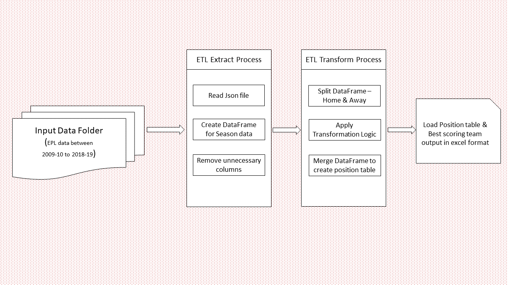
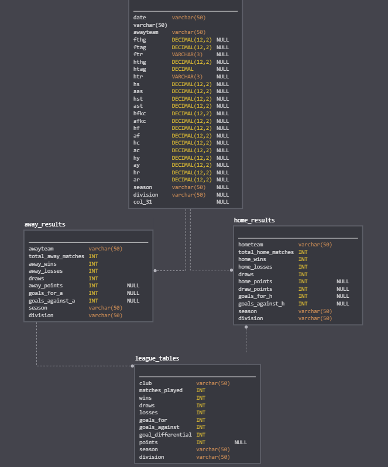

# DSR - ETL Challenge

### ETL challenge for Data Engineers.

## Introduction
The Premier League, also known as the English Premier League or the EPL is the top level of the English football league system. Contested by 20 clubs, it operates on a system of promotion and relegation with the English Football League (EFL).
The EPL has information of seasons between 09-10 and 18-19. 

## Format and history of the Premier League
The Premier League is the top tier of England's football pyramid, with 20 teams battling it out for the honour of being crowned English champions.

Home to some of the most famous clubs, players, managers and stadiums in world football, the Premier League is the most-watched league on the planet with one billion homes watching the action in 188 countries.

The league takes place between August and May and involves the teams playing each other home and away across the season, a total of 380 matches.

Three points are awarded for a win, one point for a draw and none for a defeat, with the team with the most points at the end of the season winning the Premier League title.

If any clubs finish with the same number of points, their position in the Premier League table is determined by goal difference, then the number of goals scored. If the teams still cannot be separated, they will be awarded the same position in the table.

The teams that finish in the bottom three of the league table at the end of the campaign are relegated to the Championship, the second tier of English football.

Those teams are replaced by three clubs promoted from the Championship; the sides that finish in first and second place and the third via the end-of-season playoffs.

## About the Challenge

You need to create an ETL job that prepares the data for the EPL Research team. Please consider the following:
    The Job must be an ETL code developed in Python.
    A deployment for the code is required. Please prefer using open-source tools.

Show the overall architecture of your pipeline. Include all the steps of the workflow.

We want a deployment for the ETL, please remember that best deployments are the easiest to execute.

## Data Dictionary
The EPL data has season information from 2009-10 to 2018-19.

Data Dictionary

Abbreviation -- Description

Div           --   League Division\
Date 	      --  Match Date (dd/mm/yy)\
HomeTeam 	  --   Home Team\
AwayTeam 	  --   Away Team\
FTHG 	      --   Full Time Home Team Goals\
FTAG 	      --   Full Time Away Team Goals\
FTR 	      --   Full Time Result (H|Home Win, D|Draw, A|Away Win)\
HTHG 	      --   Half Time Home Team Goals\
HTAG 	      --   Half Time Away Team Goals\
HTR 	      --   Half Time Result (H|Home Win, D|Draw, A|Away Win)\
Attendance 	  --   Crowd Attendance\
Referee 	  --   Match Referee\
HS 	          --   Home Team Shots\
AS 	          --   Away Team Shots\
HST 	      --   Home Team Shots on Target\
AST 	      --   Away Team Shots on Target\
HHW 	      --   Home Team Hit Woodwork\
AHW 	      --   Away Team Hit Woodwork\
HC 	          --   Home Team Corners\
AC 	          --   Away Team Corners\
HF 	          --   Home Team Fouls Committed\
AF 	          --   Away Team Fouls Committed\
HO 	          --   Home Team Offsides\
AO 	          --   Away Team Offsides\
HY 	          --   Home Team Yellow Cards\
AY 	          --   Away Team Yellow Cards\
HR 	          --   Home Team Red Cards\
AR 	          --   Away Team Red Cards\
HBP 	      --   Home Team Bookings Points (10 | yellow, 25 | red)\
ABP 	      --   Away Team Bookings Points (10 | yellow, 25 | red)\

## Overall Architechture and Process flow

The ETL process broadly goes thru three stages:
1. Extract
2. Transform
3. Load

we will follow the same appraoch in our job development process. Detailing out each step:

### Extract
1. We have already been provided with EPL season data in json file. Each file contains the complete information about the season's game.
2. We will write Python code to iterate through each file and create a DataFrame.
3. There are many columns which are not required for our ETL process. we will remove them from our DataFrame.
4. We will check the datatype of each columns and date format of date column and see if it require any fixing.

### Transform
1. In transformation step, required logic will be implemented to derive desired result.
2. We will create two new dataframe which will hold information about home team and away team.
3. Using information from existing columns, we will create new columns which will hold information regarding Points earned, game win/loss/draw, total matches played etc.
4. Once we have all required information to create position table and to find best scoring team for all the seasons, we will concat away team dataframe with home team dataframe to generate desired results.

### EPL ETL Architecture

### Load
1. Once the data transformation is complete, output file will be generated.
2. Output file is in excel format as it is easy to filter data and read.

### EPL ETL Data Flow

## Deployment
We will be using docker for this project and deployment instructions are mentioned in deployment.md of the deploy folder
